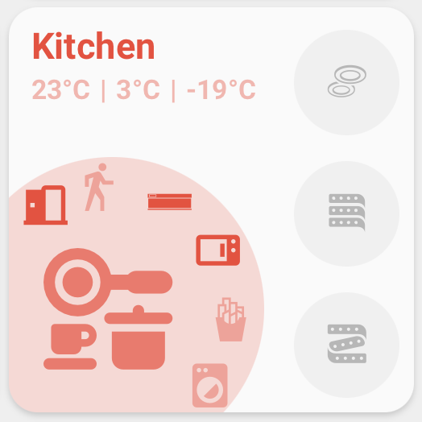
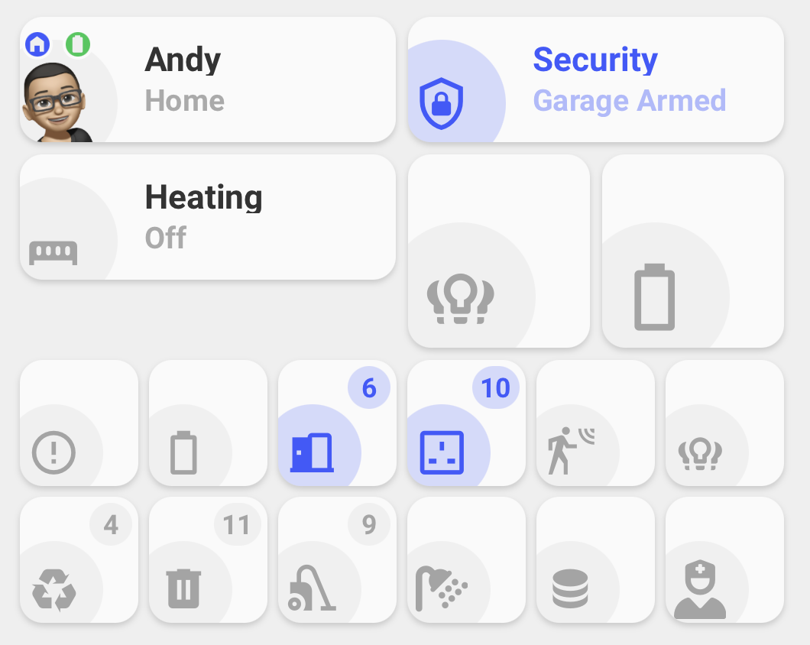
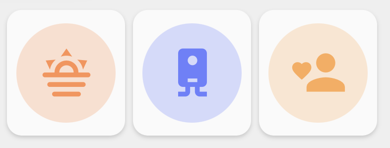
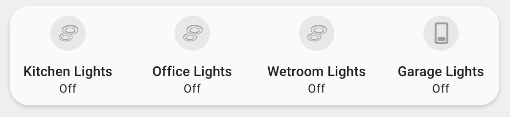
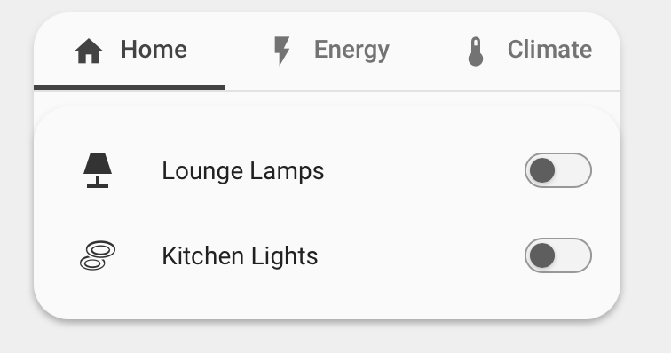

# Orbit Cards


[](https://github.com/hacs/frontend)
[](https://github.com/Andyblac/Orbit-Cards/releases)
[](LICENSE)


[](https://github.com/Andyblac/Orbit-Cards)
[](https://github.com/Andyblac/Orbit-Cards/issues)

Orbit Cards is a collection of modern Home Assistant dashboard cards with a shared visual style, shared editor controls, and support for custom icons, dynamic colours, popups, navigation, and compact grouped layouts.

---

## Cards

<table>
  <tr>
    <td width="50%" valign="top" align="center">
      <h3>Area Card</h3>
      <p><code>custom:orbit-area-card</code></p>
      
      <p align="left">An area overview with status text, a main entity, side buttons, curved quick actions, and navigation.</p>
    </td>
    <td width="50%" valign="top" align="center">
      <h3>Status Card</h3>
      <p><code>custom:orbit-status-card</code></p>
      
      <p align="left">Visual entity summaries in Standard, Person, Icon only, and compact grouped Icon only modes.</p>
    </td>
  </tr>
  <tr>
    <td width="50%" valign="top" align="center">
      <h3>Action Card</h3>
      <p><code>custom:orbit-action-card</code></p>
      
      <p align="left">Compact controls for scenes, scripts, automations, buttons, cameras, and grouped shortcuts.</p>
    </td>
    <td width="50%" valign="top" align="center">
      <h3>Deck Card</h3>
      <p><code>custom:orbit-deck-card</code></p>
      <p><strong>Wrap</strong></p>
      
      <p><strong>Tabs</strong></p>
      
      <p align="left">A generic container that arranges any Lovelace cards in a shared wrap layout or switches between them with tabs.</p>
    </td>
  </tr>
</table>

## Features

- Built-in visual editors for all cards.
- Tabbed editor sections with grouped controls for area/card settings, status fields, buttons, curved buttons, and action buttons.
- Shared colour handling across cards.
- Named colours, theme colours, hex colours, `rgb()`, `hsl()`, and light colour support where supported.
- Colour preview swatches with a native colour picker and selectable theme colour previews.
- Material Design Icons and local SVG/image icons.
- Tap, hold, navigation, service, popup, and Browser Mod actions.
- Dynamic entity state updates scoped to only the entities used by each card.
- Grouped compact layouts for Status Icon only and Action Card.
- Deck Card layouts for wrapping any Lovelace cards into rows or showing them as tabs.

## Installation

### HACS

1. Open HACS.

2. Go to `Frontend`.

3. Open the menu and choose `Custom repositories`.

4. Add:
   
   ```text
   https://github.com/andyblac/Orbit-Cards
   ```

5. Select category `Dashboard`.

6. Install `Orbit Cards`.

7. Refresh Home Assistant.

8. Add one of the Orbit cards from the dashboard card picker.

### Manual

1. Download `dist/orbit-cards.js` from the repository.

2. Copy it to:
   
   ```text
   /config/www/orbit-cards.js
   ```

3. Optional: to use bundled `orbit:` icons with a manual install, copy `dist/icons` to:
   
   ```text
   /config/www/icons
   ```

4. In Home Assistant, go to `Settings` -> `Dashboards` -> `Resources`.

5. Add this resource:
   
   ```text
   /local/orbit-cards.js
   ```

6. Set the resource type to `JavaScript module`.

7. Refresh Home Assistant.

## Updating

After updating the JavaScript file, refresh the browser or reload Home Assistant frontend resources. Some browsers and Home Assistant apps cache frontend resources aggressively, so a hard refresh may be needed after manual updates.

## Compatibility

- Home Assistant Lovelace dashboards.
- Home Assistant 2025.6.0 and newer recommended.
- HACS or manual resource installation.
- Browser Mod is required only for Browser Mod popup actions.
- Bubble Card is required only for Bubble Card hash popups.
- `custom:orbit-room-card` remains registered as a legacy alias for `custom:orbit-area-card`.
- `room_name` remains supported as a legacy alias for `area_name`.
- Legacy Area Card configs are migrated when the editor opens: `custom:orbit-room-card` is rewritten to `custom:orbit-area-card`, and `room_name` is rewritten to `area_name`.

## Support

For bugs, feature requests, and releases, use the GitHub repository:
[andyblac/Orbit-Cards](https://github.com/andyblac/Orbit-Cards)

A WiKi guide is available:
[Here](https://github.com/andyblac/Orbit-Cards/wiki)
## Credits

Created by AndyBlac.
